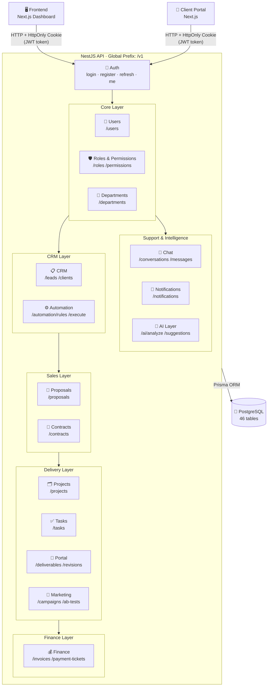
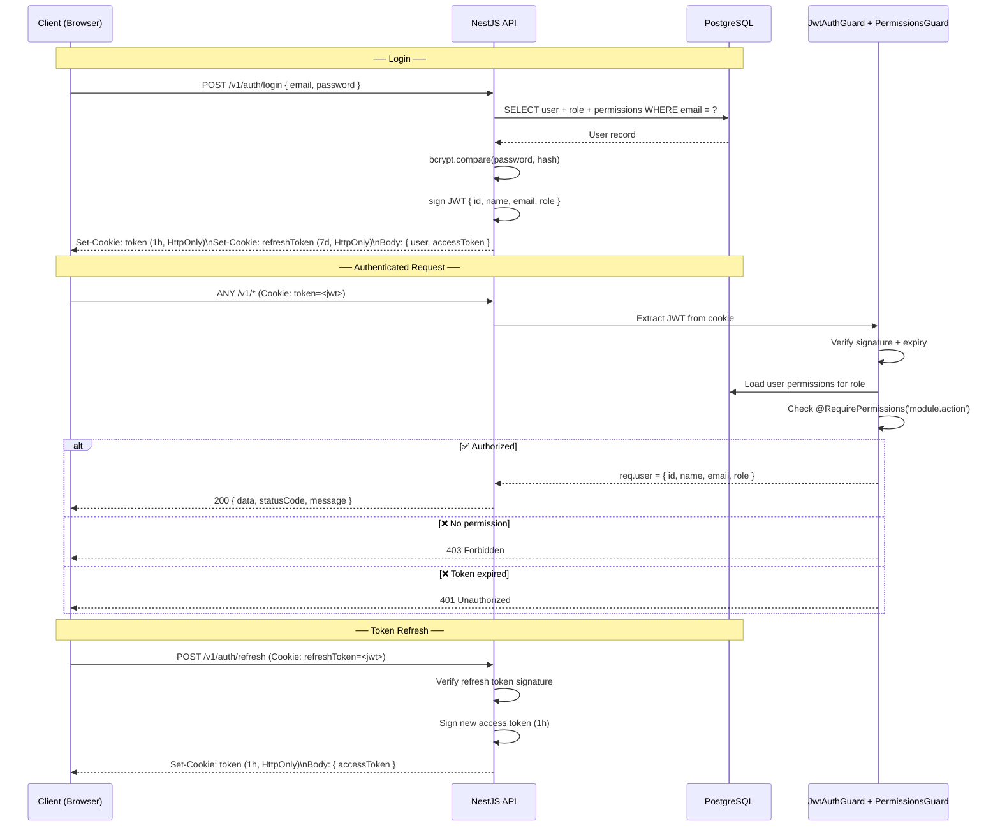
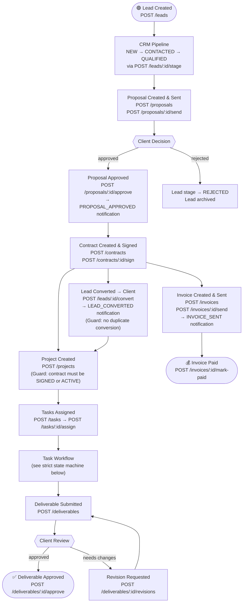
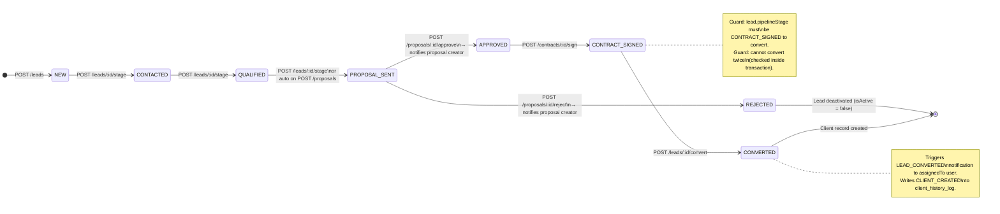
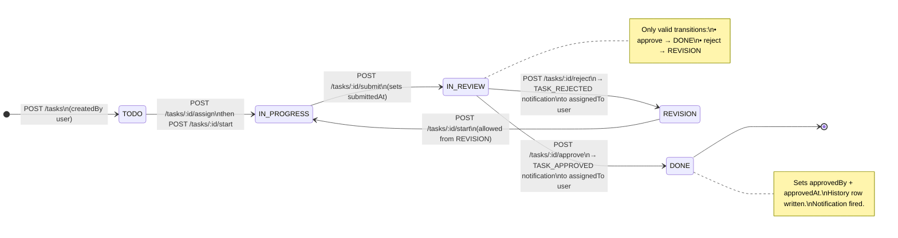
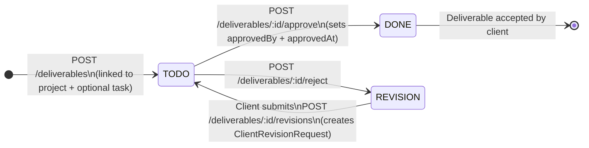
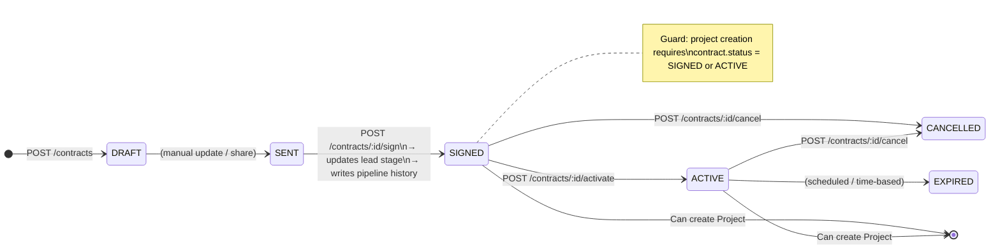

<div align="center">

# 🌾 Hassad Platform (V2)
### The Ultimate SaaS Engine for Marketing Agencies — Redesigned for Scale
Built with **Strict Architecture** and **High-Performance Infrastructure**.

[](https://turbo.build/)
[](https://nextjs.org/)
[](https://nestjs.com/)
[](https://prisma.io/)
[](https://opensource.org/licenses/MIT)

</div>

---

## 🚀 Overview (V2)

**Hassad** (حَصاد) is an enterprise-grade SaaS platform for marketing agencies. V2 features a complete architectural redesign with a unified data layer of **46 tables**, a fully spec-compliant API with **12 modules**, strict workflow enforcement, granular RBAC, and a wired notification system.

### Key V2 Features
- **Full CRM Pipeline**: Lead acquisition → proposal → contract → client conversion with enforced stage transitions and full history logging
- **Strict Task Flow**: A 5-state task machine (TODO → IN\_PROGRESS → IN\_REVIEW → DONE) with a REVISION loop — no skipping states
- **Automation Engine**: Rule-based lead automation with condition/action JSON definitions and execution logging
- **Live Notifications**: Business events (lead converted, proposal approved/rejected, invoice sent, task approved/rejected) write to `notification_events` and `notifications` tables in real-time
- **Client Portal**: Deliverable review, revision requests, and intake forms
- **Zero-JS Token Strategy**: JWT + RefreshToken stored in HttpOnly cookies — invisible to XSS
- **Granular Permissions**: Every endpoint is gated by a named permission key via `PermissionsGuard`
- **No Hard Deletes**: All removals use `is_active` / `is_archived` flags to preserve business audit trails

---

## 🛠️ Tech Stack

### Core Infrastructure
| Layer | Technology |
|---|---|
| Monorepo | [Turborepo](https://turbo.build/) |
| Frontend | [Next.js 15](https://nextjs.org/) — App Router, TypeScript, Tailwind CSS, shadcn/ui |
| Backend | [NestJS 11](https://nestjs.com/) — REST API, global prefix `v1` |
| Database | PostgreSQL 17 (Docker), [Prisma 6](https://prisma.io/) ORM |
| State Mgmt | [Redux Toolkit](https://redux-toolkit.js.org/) + RTK Query |
| Auth | JWT (access 1h) + RefreshToken (7d) via HttpOnly Cookies |
| Storage | [Cloudflare R2](https://www.cloudflare.com/products/r2/) (S3-compatible) |
| Deployment | Docker, Docker Compose |

---

## 📂 Repository Structure

```
hassad-platform/
├── apps/
│   ├── web/              ← Next.js (Dashboard + Client Portal)
│   └── api/              ← NestJS (Central API V2)
│       ├── prisma/       ← Schema (46 tables) & migration history
│       └── src/
│           ├── auth/     ← JWT strategy, guards, login/register
│           ├── modules/  ← 12 business modules
│           └── common/   ← Guards, interceptors, decorators
├── packages/
│   └── shared/           ← Shared enums, DTOs, and types
├── docker-compose.yml    ← Infrastructure (PostgreSQL)
└── turbo.json            ← Build pipeline
```

---

## 🏗️ System Architecture

The API is organized into layers. Auth gates every request. The Core layer provides the RBAC foundation for all modules. Business data flows from CRM (top of funnel) through delivery and closes in Finance.



---

## 🔐 Authentication Flow

All tokens are stored in **HttpOnly cookies** — never accessible to JavaScript.



**Auth Endpoints:**

| Method | Path | Guard | Description |
|---|---|---|---|
| POST | `/auth/login` | Public | Login, sets HttpOnly cookies |
| POST | `/auth/refresh` | RefreshToken cookie | Issues new access token |
| GET | `/auth/me` | JwtAuthGuard | Returns current user profile |
| POST | `/auth/register` | Public | Client self-registration |
| POST | `/auth/register-internal` | JwtAuthGuard + ADMIN role | Creates internal staff account |

---

## 🔄 Core Business Lifecycle

The full journey from first contact to paid invoice.



---

## 📊 CRM — Lead Pipeline



---

## ✅ Task Workflow (Strict State Machine)

No state can be skipped. Every transition writes a row to `task_status_history`.



---

## 📦 Deliverable Flow



---

## 📝 Contract Lifecycle



---

## 🔔 Notification Events

All notifications are created as a two-row write: one `notification_events` row (the cause) and one `notifications` row (the recipient inbox item).

| Trigger Action | Event Type | Notified User | Triggered In |
|---|---|---|---|
| `POST /leads/:id/convert` | `LEAD_CONVERTED` | Lead's `assignedTo` user | `leads.service.ts` |
| `POST /proposals/:id/approve` | `PROPOSAL_APPROVED` | Proposal `createdBy` user | `proposals.service.ts` |
| `POST /proposals/:id/reject` | `PROPOSAL_REJECTED` | Proposal `createdBy` user | `proposals.service.ts` |
| `POST /invoices/:id/send` | `INVOICE_SENT` | Invoice `createdBy` user | `finance.service.ts` |
| `POST /tasks/:id/approve` | `TASK_APPROVED` | Task `assignedTo` user | `tasks.service.ts` |
| `POST /tasks/:id/reject` | `TASK_REJECTED` | Task `assignedTo` user | `tasks.service.ts` |

> **Read notifications**: `GET /v1/notifications` — returns inbox for the current user.
> **Mark read**: `POST /v1/notifications/mark-read` or `POST /v1/notifications/mark-all-read`.

---

## 📋 API Quick Reference

All routes are prefixed with `/v1`. Every route requires a valid JWT cookie except `POST /auth/login`, `POST /auth/register`, and `POST /auth/refresh`.

### 🔐 Auth
| Method | Path | Permission | Description |
|---|---|---|---|
| POST | `/auth/login` | Public | Login, sets HttpOnly JWT cookies |
| POST | `/auth/refresh` | Refresh cookie | Rotates access token |
| GET | `/auth/me` | Authenticated | Current user profile |
| POST | `/auth/register` | Public | Client self-registration |
| POST | `/auth/register-internal` | ADMIN role | Create internal staff account |

### 👤 Users & Core
| Method | Path | Permission | Description |
|---|---|---|---|
| GET | `/users` | `users.read` | List all users |
| POST | `/users` | `users.create` | Create user |
| GET | `/users/:id` | `users.read` | Get user by ID |
| PATCH | `/users/:id` | `users.update` | Update user |
| DELETE | `/users/:id` | `users.delete` | Soft-delete user |
| POST | `/users/:id/departments` | `departments.assign` | Assign user to department |
| GET | `/roles` | `roles.read` | List roles |
| POST | `/roles` | `roles.create` | Create role |
| PATCH | `/roles/:id` | `roles.update` | Update role |
| POST | `/roles/:id/permissions` | `roles.manage_permissions` | Assign permissions to role |
| GET | `/permissions` | `permissions.read` | List all permission keys |
| GET | `/departments` | `departments.read` | List departments |
| POST | `/departments` | `departments.create` | Create department |

### 📋 CRM — Leads
| Method | Path | Permission | Description |
|---|---|---|---|
| POST | `/leads` | `leads.create` | Create lead |
| GET | `/leads` | `leads.read` | List active leads |
| GET | `/leads/:id` | `leads.read` | Get lead with history & logs |
| PATCH | `/leads/:id` | `leads.update` | Update lead fields |
| POST | `/leads/:id/assign` | `leads.assign` | Assign lead to a user |
| POST | `/leads/:id/contact-log` | `leads.log` | Add contact log entry |
| GET | `/leads/:id/contact-log` | `leads.read` | Get all contact logs |
| POST | `/leads/:id/stage` | `leads.change_stage` | Move lead to next pipeline stage |
| POST | `/leads/:id/convert` | `leads.convert` | Convert lead to client |

### 👥 CRM — Clients
| Method | Path | Permission | Description |
|---|---|---|---|
| GET | `/clients` | `clients.read` | List all clients |
| GET | `/clients/:id` | `clients.read` | Get client details |
| PATCH | `/clients/:id` | `clients.update` | Update client (writes history log) |
| GET | `/clients/:id/activity` | `clients.read` | Get client activity log |

### ⚙️ Automation
| Method | Path | Permission | Description |
|---|---|---|---|
| POST | `/automation/rules` | `automation.create` | Create automation rule (condition + action JSON) |
| GET | `/automation/rules` | `automation.read` | List active automation rules |
| POST | `/automation/execute` | `automation.execute` | Execute a rule against a lead (internal) |

### 📄 Proposals
| Method | Path | Permission | Description |
|---|---|---|---|
| POST | `/proposals` | `proposals.create` | Create proposal draft |
| GET | `/proposals/:id` | `proposals.read` | Get proposal |
| POST | `/proposals/:id/send` | `proposals.send` | Send to client (generates share token) |
| POST | `/proposals/:id/approve` | `proposals.approve` | Approve → updates lead stage + notifies |
| POST | `/proposals/:id/reject` | `proposals.reject` | Reject → notifies proposal creator |

### 📝 Contracts
| Method | Path | Permission | Description |
|---|---|---|---|
| POST | `/contracts` | `contracts.create` | Create contract |
| GET | `/contracts/:id` | `contracts.read` | Get contract |
| POST | `/contracts/:id/sign` | `contracts.sign` | Sign contract → updates lead stage + history |
| POST | `/contracts/:id/activate` | `contracts.activate` | Activate signed contract |
| POST | `/contracts/:id/cancel` | `contracts.cancel` | Cancel contract |
| POST | `/contracts/:id/versions` | `contracts.version` | Create a new contract version |

### 🗂️ Projects
| Method | Path | Permission | Description |
|---|---|---|---|
| POST | `/projects` | `projects.create` | Create project (contract must be SIGNED or ACTIVE) |
| GET | `/projects/:id` | `projects.read` | Get project with members and tasks |
| PATCH | `/projects/:id` | `projects.update` | Update project fields |
| POST | `/projects/:id/archive` | `projects.archive` | Archive project |
| POST | `/projects/:id/members` | `projects.manage_members` | Add member to project |
| DELETE | `/projects/:id/members/:user_id` | `projects.manage_members` | Remove member from project |

### ✅ Tasks
| Method | Path | Permission | Description |
|---|---|---|---|
| POST | `/tasks` | `tasks.create` | Create task (status: TODO) |
| GET | `/tasks/:id` | `tasks.read` | Get task with files, comments, history |
| PATCH | `/tasks/:id` | `tasks.update` | Update task fields |
| POST | `/tasks/:id/assign` | `tasks.assign` | Assign task to a user |
| POST | `/tasks/:id/start` | `tasks.start` | TODO → IN\_PROGRESS (or REVISION → IN\_PROGRESS) |
| POST | `/tasks/:id/submit` | `tasks.submit` | IN\_PROGRESS → IN\_REVIEW |
| POST | `/tasks/:id/approve` | `tasks.approve` | IN\_REVIEW → DONE + notification |
| POST | `/tasks/:id/reject` | `tasks.reject` | IN\_REVIEW → REVISION + notification |
| POST | `/tasks/:id/files` | `tasks.upload` | Attach file to task |
| GET | `/tasks/:id/files` | `tasks.read` | List task files |
| POST | `/tasks/:id/comments` | `tasks.comment` | Add comment to task |

### 🔗 Portal — Deliverables
| Method | Path | Permission | Description |
|---|---|---|---|
| POST | `/deliverables` | `portal.manage_deliverables` | Create deliverable |
| GET | `/deliverables/:id` | `portal.read` | Get deliverable with revision history |
| POST | `/deliverables/:id/approve` | `portal.approve_deliverables` | Approve deliverable |
| POST | `/deliverables/:id/reject` | `portal.approve_deliverables` | Reject deliverable → REVISION |
| POST | `/deliverables/:id/revisions` | `portal.request_revisions` | Client submits revision request |
| GET | `/deliverables/:id/revisions` | `portal.read` | List revision requests |
| POST | `/clients/:id/intake-form` | `portal.manage_intake` | Submit client intake form |
| GET | `/clients/:id/intake-form` | `portal.read` | Get client intake form |

### 📣 Marketing
| Method | Path | Permission | Description |
|---|---|---|---|
| POST | `/campaigns` | `marketing.create` | Create campaign |
| GET | `/campaigns/:id` | `marketing.read` | Get campaign details |
| POST | `/campaigns/:id/start` | `marketing.update` | Set status → ACTIVE |
| POST | `/campaigns/:id/pause` | `marketing.update` | Set status → PAUSED |
| POST | `/campaigns/:id/end` | `marketing.update` | Set status → COMPLETED |
| POST | `/campaigns/:id/kpis` | `marketing.manage_kpis` | Add KPI snapshot |
| GET | `/campaigns/:id/kpis` | `marketing.read` | List KPI snapshots |
| POST | `/campaigns/:id/ab-tests` | `marketing.manage_tests` | Create A/B test for campaign |
| POST | `/ab-tests/:id/stop` | `marketing.manage_tests` | Stop A/B test, declare winner |

### 💰 Finance
| Method | Path | Permission | Description |
|---|---|---|---|
| POST | `/invoices` | `finance.create` | Create invoice (status: DUE) |
| GET | `/invoices/:id` | `finance.read` | Get invoice with tickets |
| POST | `/invoices/:id/send` | `finance.send` | Mark as SENT + sets sentAt + notification |
| POST | `/invoices/:id/mark-paid` | `finance.collect` | Mark as PAID + sets paidAt |
| POST | `/payment-tickets` | `finance.create_ticket` | Open a payment support ticket |
| GET | `/payment-tickets/:id` | `finance.read` | Get ticket details |
| POST | `/payment-tickets/:id/resolve` | `finance.resolve_ticket` | Resolve ticket → PAID |

### 💬 Chat
| Method | Path | Permission | Description |
|---|---|---|---|
| POST | `/conversations` | `chat.create` | Create conversation |
| GET | `/conversations/:id` | `chat.read` | Get conversation details |
| POST | `/conversations/:id/participants` | `chat.update` | Add participant to conversation |
| POST | `/messages` | `chat.message` | Send a message |
| GET | `/conversations/:id/messages` | `chat.read` | List messages in conversation |

### 🔔 Notifications
| Method | Path | Permission | Description |
|---|---|---|---|
| GET | `/notifications` | Authenticated | Get current user's notification inbox |
| POST | `/notifications/mark-read` | Authenticated | Mark specific notifications as read |
| POST | `/notifications/mark-all-read` | Authenticated | Mark all notifications as read |

### 🤖 AI Layer
| Method | Path | Permission | Description |
|---|---|---|---|
| POST | `/ai/analyze` | `ai.analyze` | Trigger AI analysis on an entity |
| GET | `/ai/logs/:id` | `ai.read` | Get AI analysis log |
| GET | `/ai/suggestions` | `ai.read` | List AI-generated suggestions |
| POST | `/ai/suggestions/:id/accept` | `ai.manage` | Accept an AI suggestion |
| POST | `/ai/suggestions/:id/reject` | `ai.manage` | Reject an AI suggestion |

---

## 🧱 Modular API Structure

| # | Module | Routes | Key Entities |
|---|---|---|---|
| 1 | 🔐 **Auth** | `/auth/*` | Users, JWT cookies, refresh tokens |
| 2 | 🟣 **Core** | `/users`, `/roles`, `/permissions`, `/departments` | Users, RBAC roles, permission keys, departments |
| 3 | 🔵 **CRM** | `/leads`, `/clients`, `/automation/*` | Leads, clients, contact logs, pipeline history, automation rules |
| 4 | 🟠 **Proposals** | `/proposals` | Proposal drafts, share tokens, approval flow |
| 5 | 🟠 **Contracts** | `/contracts` | Contract versions, signing, activation |
| 6 | 🟢 **Projects** | `/projects` | Project lifecycle, team members |
| 7 | 🟢 **Tasks** | `/tasks` | Strict 5-state task machine, files, comments |
| 8 | 🟦 **Portal** | `/deliverables`, `/clients/:id/intake-form` | Client-facing deliverables, revision requests |
| 9 | 🔴 **Marketing** | `/campaigns`, `/ab-tests` | Campaign tracking, KPI snapshots, A/B tests |
| 10 | 🟡 **Finance** | `/invoices`, `/payment-tickets` | Invoices, payment tracking, support tickets |
| 11 | ⚫ **Chat** | `/conversations`, `/messages` | Internal + client conversations |
| 12 | ⚪ **Notifications** | `/notifications` | Event-driven inbox, read/unread state |
| 13 | 🔵 **AI Layer** | `/ai/*` | Analysis logs, proactive suggestions |

---

## 🚦 Roadmap & Status

| Phase | Feature | Status |
|---|---|---|
| Foundation | Database V2 — 46 tables, 81 FK relations | ✅ Done |
| Foundation | NestJS API V2 — 12 modules, all endpoints | ✅ Done |
| Phase 1 | Auth — JWT + HttpOnly cookies + refresh | ✅ Done |
| Phase 1 | RBAC — Granular `PermissionsGuard` + role matrix | ✅ Done |
| Phase 2 | CRM — Lead pipeline + contact logs + convert-to-client | ✅ Done |
| Phase 2 | CRM — Pipeline history on every stage change | ✅ Done |
| Phase 2 | CRM — Automation rules engine | ✅ Done |
| Phase 3 | Tasks — Strict 5-state workflow + `task_status_history` | ✅ Done |
| Phase 3 | Projects — Contract status validation on creation | ✅ Done |
| Phase 4 | Portal — Deliverables, revisions, intake forms | ✅ Done |
| Phase 5 | Finance — Invoice SENT state + `sent_at` column | ✅ Done |
| Phase 5 | Contracts — Pipeline history on sign + activate | ✅ Done |
| Phase 6 | Marketing — A/B test stop path fixed (`/ab-tests/:id/stop`) | ✅ Done |
| Phase 6 | Notifications — All 6 critical events wired and firing | ✅ Done |
| Phase 6 | AI Layer — Analysis + suggestion endpoints | ✅ Done |

---

## ⚙️ Getting Started

### Prerequisites
- Node.js 20+
- Docker & Docker Compose

### 1. Install dependencies
```bash
npm install
```

### 2. Start the database
```bash
docker compose up -d postgres
```

### 3. Apply the schema
> **Important**: The V2 schema has migration drift. Do **not** run `prisma migrate dev` (it will prompt a reset). The schema is kept in sync via additive raw SQL for new columns/enum values.
```bash
# From apps/api — apply Prisma schema without a destructive reset
npx prisma db push --skip-generate
npx prisma generate
```

### 4. Seed the database
```bash
# From apps/api
npx prisma db seed
```
Standard seed accounts (password: `password123`):
- `admin@hassad.com` — ADMIN role
- `pm@hassad.com` — Project Manager role
- `sales@hassad.com` — Sales role

### 5. Run development servers
```bash
npx turbo dev
```
- **Frontend**: http://localhost:3000
- **Backend API**: http://localhost:3001/v1

---

## 🔒 Security & Architecture Principles

1. **Zero-JS Token Strategy** — JWT and RefreshToken live in HttpOnly cookies. XSS cannot read them.
2. **Granular Permissions** — Every endpoint is decorated with `@RequirePermissions('module.action')`. Role permissions are loaded per-request from the DB.
3. **Strict State Machines** — Lead stages, task statuses, contract states, and deliverable states all enforce valid transitions server-side. Invalid transitions throw `400`.
4. **Immutable Audit Trails** — Every lead stage change writes to `lead_pipeline_history`. Every task status change writes to `task_status_history`. Every client update writes to `client_history_log`. No hard deletes.
5. **Transactional Writes** — Multi-table operations (convert lead, approve proposal, sign contract) run inside `prisma.$transaction()` to guarantee atomicity.
6. **Notification Decoupling** — Notification writes happen **after** the business transaction commits. A notification failure never rolls back the core operation.
7. **Additive Migrations Only** — New enum values and columns are added via raw SQL (`ALTER TYPE ... ADD VALUE`, `ALTER TABLE ... ADD COLUMN IF NOT EXISTS`) to avoid destructive migration drift.

---

## 📄 License

This project is licensed under the MIT License — see the [LICENSE](LICENSE) file for details.
