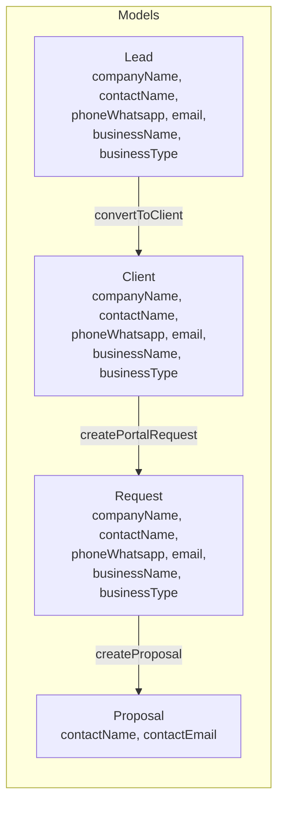

# Client Profile System — Design Spec

**Date:** 2026-06-15
**Status:** Draft
**Audience:** Engineering team

---

## 1. Problem Statement

The Hassad platform lacks a centralized client profile. Today:

1. **Client identity is duplicated on every Request** — `companyName`, `contactName`, `phoneWhatsapp`, `email`, `businessName`, `businessType` are snapshotted identically across `Lead`, `Client`, `Request`, and partially `Proposal`. A returning client must re-enter the same information for each new project.

2. **No business context is stored** — The `Client` model holds only identity fields (name, phone, type). Business description, industry, goals, target audience, brand guidelines, and budget preferences have no home. The `PortalIntakeForm` model exists but is dead code — never wired to the frontend.

3. **No project history is visible to staff** — Sales reps and PMs cannot see a client's previous projects, contract values, satisfaction scores, or aggregated history. The `ClientHistoryLog` captures only `CLIENT_CREATED` and `CLIENT_UPDATED` events.

4. **No streamlined repeat-request flow** — Every new project forces the client through the same intake form. There is no "create request for existing client" flow where a sales rep picks services and the identity is read from the canonical Client record.

---

## 2. Current System Analysis

### 2.1 Data Duplication Map

Six identity fields appear in five models:



Root cause: The system copies identity fields rather than reading from the canonical Client via the `clientId` FK.

### 2.2 Existing Client Model (Prisma — Key Fields Only)

```prisma
model Client {
  id              String   @id @default(uuid())
  leadId          String?  @unique
  companyName     String
  contactName     String
  phoneWhatsapp   String
  email           String?
  businessName    String
  businessType    BusinessType
  accountManager  String?
  status          ClientStatus
  userId          String?  @unique
  intakeCompleted Boolean  @default(false)

  // Relations (17 total): contracts[], projects[], requests[],
  // proposals[], invoices[], payments[], historyLogs[], etc.
}
```

### 2.3 What Exists (Reusable)

| Component                | Status                                     | Location                                                    |
| ------------------------ | ------------------------------------------ | ----------------------------------------------------------- |
| `CanonicalClientService` | Active — deduplication engine              | `apps/api/src/modules/requests/canonical-client.service.ts` |
| `ClientHistoryLog`       | Active — flat event log                    | `apps/api/prisma/schema.prisma`                             |
| `PortalIntakeForm`       | Dead code — model + endpoints exist, no UI | `apps/api/prisma/schema.prisma:839`                         |
| `ClientInfoCard`         | Active — displays identity                 | `apps/web/components/dashboard/crm/ClientInfoCard.tsx`      |
| `ClientTimeline`         | Active — activity log display              | `apps/web/components/dashboard/crm/ClientTimeline.tsx`      |
| `ClientsTable`           | Built but unused — not wired to any page   | `apps/web/components/dashboard/crm/ClientsTable.tsx`        |
| `ClientFiltersBar`       | Built but unused                           | `apps/web/components/dashboard/crm/ClientFiltersBar.tsx`    |
| `CreateClientDialog`     | Built but unused                           | `apps/web/components/dashboard/crm/CreateClientDialog.tsx`  |
| `RequirementsForm`       | Active — redundant with ClientInfoCard     | `apps/web/components/dashboard/crm/RequirementsForm.tsx`    |

### 2.4 Gaps

| Gap                                                                  | Impact                                                                            |
| -------------------------------------------------------------------- | --------------------------------------------------------------------------------- |
| No business profile (description, industry, goals, audience, budget) | Sales/PMs lack context about the client                                           |
| No project history aggregated per client                             | Sales doesn't know if client is returning; PM doesn't see past projects           |
| `Request` duplicates identity via schema                             | Every new request re-asks for identity; client model drift over time              |
| No `DIRECT` source enum value                                        | Cannot distinguish "returning client" requests from first-time portal submissions |
| `Client` shared type missing `userId` and `intakeCompleted`          | Frontend type-safety gap                                                          |
| No "create request for existing client" endpoint                     | Sales must use the same form as portal clients, re-entering all data              |
| 4 placeholder cards in admin client detail                           | All show "coming soon" — no projects, invoices, chats, or contracts               |
| PMs have zero client visibility                                      | No client list, no client detail, no client name on project cards                 |

---

## 3. Solution Overview

Three targeted additions to the data model + new API endpoints + enhanced UI.

```
┌────────────────────────────────────────────────────────┐
│                   CLIENT PROFILE SYSTEM                 │
├────────────────────────────────────────────────────────┤
│                                                        │
│  Client (identity layer)                                │
│  ├── id, companyName, contactName, phone, email, ...   │
│  ├── +denormalized counters (total projects, etc.)      │
│  │                                                      │
│  ├── ClientProfile (context layer) — 1:1               │
│  │   ├── industry, businessDescription                  │
│  │   ├── targetAudience, budgetRangeMin/Max             │
│  │   ├── preferredPlatforms, competitors                │
│  │   ├── brandAssets (Json)                             │
│  │   └── customFields (Json) — flexible extension       │
│  │                                                      │
│  └── Request (no identity duplication)                  │
│      └── reads identity from client relation            │
│                                                        │
└────────────────────────────────────────────────────────┘
```

---

## 4. Data Model

### 4.1 ClientProfile Model (New)

```prisma
/// 1:1 with Client. Stores business context and preferences.
/// Uses typed columns for queryable fields + customFields Json
/// for future extensibility without schema migrations.
model ClientProfile {
  id                    String @id @default(uuid())
  clientId              String @unique
  client                Client @relation(fields: [clientId], references: [id], onDelete: Cascade)

  // === Typed Core Fields ===

  /// Industry classification (e.g., "Food & Beverage", "E-commerce", "Healthcare")
  industry              String?

  /// Free-text business description
  businessDescription   String? @db.Text

  /// Target audience description
  targetAudience        String?

  /// Budget range in SAR
  budgetRangeMin        Float?
  budgetRangeMax        Float?

  /// Preferred communication channel
  communicationPreference String? // "email" | "whatsapp" | "phone" | "chat"

  /// Preferred language for communication
  preferredLanguage     String? @default("ar")

  /// Timezone
  timezone              String? @default("Asia/Riyadh")

  // === Structured Data ===

  /// Comma-separated or JSON array of platform codes
  preferredPlatforms    String? // "google,meta,tiktok,snapchat"

  /// JSON array of competitor info: [{ name, url, notes }]
  competitors           Json?

  /// JSON: { logoUrl, brandColors[], fonts[], guidelinesUrl }
  brandAssets           Json?

  // === Flexible Extension ===

  /// Admin-configurable custom fields: { "fieldKey": value }
  /// Allows adding new profile fields without schema changes.
  customFields          Json?

  // === Metadata ===

  createdBy             String?
  createdAt             DateTime @default(now())
  updatedAt             DateTime @updatedAt
}
```

**Why typed columns + Json?**

| Approach            | Pros                                                             | Cons                                           |
| ------------------- | ---------------------------------------------------------------- | ---------------------------------------------- |
| Typed columns only  | Type-safe, queryable, indexed                                    | Every new field needs a migration              |
| Pure Json           | Zero migrations, fully flexible                                  | No queryability, no validation, no type safety |
| **Hybrid (chosen)** | Core fields queryable + filterable; customJson for extensibility | Requires judgment about what goes where        |

**Rules for what goes in typed columns vs. customFields:**

- Typed column: has a defined business meaning and is used in queries/filters/lists
- customFields: experimental, client-specific, or future fields not yet standardized

### 4.2 Client Model — Denormalized Counters

Add computed counters to `Client` to avoid expensive aggregation queries on every profile page load:

```prisma
model Client {
  // ... existing fields unchanged ...

  // === Denormalized Counters (computed, not manual) ===

  totalProjects         Int      @default(0)
  activeProjects        Int      @default(0)
  completedProjects     Int      @default(0)
  cancelledProjects     Int      @default(0)
  totalContractValue    Float    @default(0)
  totalInvoiced         Float    @default(0)
  totalPaid             Float    @default(0)
  lastProjectAt         DateTime?
  avgSatisfactionScore  Float?   // 0.0 — 5.0

  // === New Relation ===
  profile               ClientProfile?
}
```

**Counter update strategy:** A `ClientCounterService` hooks into relevant business events:

| Event                        | Counter                                          |
| ---------------------------- | ------------------------------------------------ |
| Project status → ACTIVE      | `activeProjects++`                               |
| Project status → COMPLETED   | `completedProjects++`                            |
| Project status → CANCELLED   | `cancelledProjects++`                            |
| Contract → SIGNED            | `totalContractValue += monthlyValue`             |
| Invoice → PAID               | `totalInvoiced += amount`, `totalPaid += amount` |
| Payment → recorded           | `totalPaid += amount`                            |
| SatisfactionRating → created | Recompute `avgSatisfactionScore`                 |

These updates run `after` the core transaction commits (fire-and-forget), matching the existing notification pattern. A counter failure must never roll back business data.

### 4.3 Request — Identity Deprecation

The `Request` model currently has 6 duplicated identity fields. Strategy:

**Phase 4 (cleanup):**

1. Add `@deprecated` JSDoc comments in the Prisma schema
2. Stop writing to these fields in the service layer (read from `request.client` instead)
3. Update all frontend consumers to read identity from `request.client.relation`
4. After all consumers are migrated, drop the columns in a future schema cleanup

The fields remain in the DB for backward compatibility with existing data.

### 4.4 ClientSource Enum — Add DIRECT

```prisma
enum ClientSource {
  AD
  REFERRAL
  WEBSITE
  WHATSAPP
  PLATFORM
  DIRECT  // NEW — created by sales for existing client
}
```

### 4.5 ClientHistoryLog — Enriched Event Types

Replace the free-form `eventType: String` with a richer set. Add these event types alongside existing ones:

```
CLIENT_PROFILE_CREATED
CLIENT_PROFILE_UPDATED
CLIENT_REQUEST_CREATED      // returning-client request via sales
CLIENT_PROJECT_STARTED
CLIENT_PROJECT_COMPLETED
CLIENT_PROJECT_CANCELLED
CLIENT_INVOICE_PAID
CLIENT_SATISFACTION_RATED
CLIENT_COUNTERS_UPDATED
```

The `metadata` Json field captures context: project ID, invoice ID, score, etc.

---

## 5. API Design

### 5.1 Client Profile Endpoints

| Method  | Endpoint               | Permission       | Description                                           |
| ------- | ---------------------- | ---------------- | ----------------------------------------------------- |
| `GET`   | `/clients/:id/profile` | `clients.read`   | Get profile (returns ClientProfile + Client counters) |
| `PUT`   | `/clients/:id/profile` | `clients.update` | Create or update profile (upsert)                     |
| `PATCH` | `/clients/:id/profile` | `clients.update` | Partial update of profile                             |

**GET Response:**

```json
{
  "success": true,
  "data": {
    "client": {
      "id": "uuid",
      "companyName": "شركة النور",
      "contactName": "أحمد محمد",
      "phoneWhatsapp": "+9665xxxxxxx",
      "email": "ahmed@example.com",
      "businessName": "شركة النور للتجارة",
      "businessType": "RESTAURANT",
      "status": "ACTIVE"
    },
    "profile": {
      "industry": "Food & Beverage",
      "businessDescription": "Restaurant chain with 5 branches",
      "targetAudience": "Saudi families 25-45",
      "budgetRangeMin": 50000,
      "budgetRangeMax": 100000,
      "preferredPlatforms": "google,meta",
      "communicationPreference": "whatsapp",
      "customFields": {}
    },
    "counters": {
      "totalProjects": 8,
      "activeProjects": 2,
      "completedProjects": 5,
      "cancelledProjects": 1,
      "totalContractValue": 245000,
      "totalInvoiced": 180000,
      "totalPaid": 165000,
      "avgSatisfactionScore": 4.2
    }
  }
}
```

**PUT/PATCH Request DTO:**

```typescript
interface UpsertClientProfileDto {
  industry?: string;
  businessDescription?: string;
  targetAudience?: string;
  budgetRangeMin?: number;
  budgetRangeMax?: number;
  communicationPreference?: string;
  preferredLanguage?: string;
  timezone?: string;
  preferredPlatforms?: string;
  competitors?: { name: string; url?: string; notes?: string }[];
  brandAssets?: {
    logoUrl?: string;
    brandColors?: string[];
    fonts?: string[];
    guidelinesUrl?: string;
  };
  customFields?: Record<string, unknown>;
}
```

### 5.2 Request Endpoint for Returning Clients

| Method | Endpoint               | Permission     | Description                                               |
| ------ | ---------------------- | -------------- | --------------------------------------------------------- |
| `POST` | `/requests/for-client` | `leads.create` | Create request for existing client (no identity re-entry) |

**DTO:**

```typescript
interface CreateRequestForClientDto {
  clientId: string;
  services: {
    serviceId: string;
    quantity?: number;
    notes?: string;
  }[];
  notes?: string;
}
```

**What the service does:**

1. Validate client exists and `client.status !== STOPPED`
2. Load client identity from the Client record directly (no `CanonicalClientService` upsert — client already exists)
3. Assign sales rep: prefer `client.accountManager`, fall back to `SalesAssignmentService.findBestSales()`
4. Create `Request` with:
   - `clientId` = given clientId
   - Deprecated identity fields: **left null** (read from `request.client` going forward)
   - `source` = `DIRECT`
   - `status` = `SUBMITTED`
   - `services` = from DTO
   - `notes` = from DTO
   - `assignedSalesId` = resolved sales rep
5. Write `RequestStatusHistory` (initial: SUBMITTED)
6. Write `ClientHistoryLog` (event: `CLIENT_REQUEST_CREATED`, metadata: `{ requestId }`)
7. Send notification to assigned sales rep (after transaction commits)

### 5.3 Client List Endpoint Enhancement

Update `GET /clients` to accept an optional `includeCounters` query param and return counters:

```
GET /v1/clients?status=ACTIVE&search=النور&page=1&limit=20&includeCounters=true
```

This powers the sales client list page with project counts per row.

### 5.4 Client Detail Endpoint Enhancement

Update `GET /clients/:id` to include:

- `profile` (ClientProfile)
- Denormalized counters
- `recentProjects` — last 5 projects with status, contract value, dates, PM name

---

## 6. Business Logic Rules

### 6.1 Counter Update Hooks

```typescript
class ClientCounterService {
  async onProjectStatusChange(projectId: string): Promise<void>; // Recompute all project counters
  async onContractSigned(contractId: string): Promise<void>; // totalContractValue +=
  async onInvoicePaid(invoiceId: string): Promise<void>; // totalInvoiced +=, totalPaid +=
  async onSatisfactionRated(clientId: string): Promise<void>; // Recompute avg score
  async recomputeAll(clientId: string): Promise<void>; // Full recompute (admin repair tool)
}
```

Counter updates are:

- **Fire-and-forget** — never block the originating transaction
- **Idempotent** — safe to call multiple times
- **Loggable** — write a `CLIENT_COUNTERS_UPDATED` history log for audit

### 6.2 Returning Client Request Validation

- Client must not be `STOPPED` (throws 400)
- At least one service must be selected (throws 400)
- Sales rep must have `leads.create` permission (handled by `PermissionsGuard`)
- No lead is created (this is a request, not a lead — the client already exists)

### 6.3 Profile Edit Rules

- Profile can be created/updated by sales team and admin
- PMs can view profile but not edit
- Client can view their own profile via portal (read-only)
- `customFields` is an opaque Json: validate that it's an object at the controller level; individual field validation is deferred to the UI layer

---

## 7. UI Design

### 7.1 Route Map

```
/dashboard/sales/clients               → Client list page (NEW)
/dashboard/sales/clients/[id]          → Client profile page (ENHANCED)
/dashboard/admin/clients               → Keep as-is (user management)
/dashboard/admin/clients/[id]          → Client profile page (ENHANCED)
/dashboard/pm/projects/[id]            → Clickable client name → read-only profile
/dashboard/finance/clients/[clientId]  → Keep as-is (add link to full profile)
/portal/account                        → Add "My Profile" tab
```

### 7.2 Client List Page (Sales)

**Route:** `/dashboard/sales/clients`
**Component:** Existing `ClientsTable` + `ClientFiltersBar` (currently unused — wire them)

Columns: Company Name, Contact Name, Phone, Status, Projects Count, Account Manager, Last Activity

Actions:

- Click row → client profile
- Filter by status (ACTIVE/LEAD/STOPPED)
- Search by company name or contact name

### 7.3 Client Profile Page (Tabbed)

**Route:** `/dashboard/sales/clients/[id]`

#### Tab 1: Overview

```
┌─────────────────────────────────────────────────────────────┐
│  Header: companyName | status badge | accountManager name   │
│         contactName • phone • email • Client since createdAt│
│  Actions: [Edit Profile] [New Request]                      │
├──────────────────────┬──────────────────────┬────────────────┤
│  Total Projects: 8   │  Contract Value:     │  Avg Rating    │
│  ● Active: 2         │  SAR 245,000         │  4.2 / 5.0     │
│  ● Completed: 5      │  Invoiced: 180,000   │                │
│  ● Cancelled: 1      │  Collected: 165,000  │                │
├──────────────────────┴──────────────────────┴────────────────┤
│  Industry: Food & Beverage                                  │
│  Budget: SAR 50k — 100k                                     │
│  Preferred Platforms: Google, Meta                          │
│  Last Project: Jun 2026                                     │
└─────────────────────────────────────────────────────────────┘
```

#### Tab 2: Projects

Filterable table: Name | Status | PM | Start Date | End Date | Contract Value | Satisfaction

#### Tab 3: Finance

Summary cards + invoices table + payments table (reuse existing finance components)

#### Tab 4: Activity

Enhanced `ClientTimeline` — now includes project events, invoice payments, satisfaction ratings

#### Tab 5: Profile (Edit)

Form for `ClientProfile` fields: industry, business description, target audience, budget range, preferred platforms, competitors, brand assets, custom fields. Editable by sales/admin.

### 7.4 New Request Modal

Opened from profile page header button. Modal with:

```
┌─────────────────────────────────────────────┐
│  New Request — {companyName}                │
├─────────────────────────────────────────────┤
│  Client Info (read-only)                    │
│  ┌─ Company, Contact, Phone, Business Type ─┐│
│  └──────────────────────────────────────────┘│
│                                              │
│  Services (required)                         │
│  ┌─ Service checkboxes ─────────────────────┐│
│  └──────────────────────────────────────────┘│
│                                              │
│  Notes (optional)                            │
│  ┌─ textarea ───────────────────────────────┐│
│  └──────────────────────────────────────────┘│
│                                              │
│  Source: Direct (auto)                       │
│                    [Cancel]  [Create Request] │
└─────────────────────────────────────────────┘
```

### 7.5 Kanban Card Enhancement

Add a subtle indicator for returning clients:

- If `client.totalProjects > 0`, show a small badge: `↳ 3 previous projects`
- Company name is a clickable link → client profile page
- This requires `GET /requests` to include the client's counters

### 7.6 Portal — Simplified New Order

When `client.intakeCompleted === true` (returning client):

- Identity section is pre-filled and read-only
- Only service selection + description are interactive
- Label: "You're a returning client — just tell us what you need"

---

## 8. Migration Plan

### Phase 1: Foundation (Database + API)

**Estimated effort:** 3–5 days

1. Add `ClientProfile` model to Prisma schema
2. Add denormalized counter columns to `Client`
3. Add `DIRECT` to `ClientSource` enum
4. Mark identity fields on `Request` as deprecated
5. Run `prisma db push`
6. Create `ClientProfileService` (CRUD + upsert)
7. Create `ClientCounterService` (update hooks + full recompute)
8. Create `/clients/:id/profile` endpoints
9. Create `/requests/for-client` endpoint
10. Update `GET /clients` and `GET /clients/:id` to include counters + profile
11. Update shared `@hassad/shared` types
12. Write backfill script for existing clients (counters + empty profiles)
13. Wire counter hooks into existing business events (project status, invoice paid, satisfaction rating)

### Phase 2: Sales UI

**Estimated effort:** 4–6 days

1. Wire existing `ClientsTable` + `ClientFiltersBar` into `/dashboard/sales/clients`
2. Build tabbed client profile page (reuse `ClientInfoCard`, `ClientTimeline`, finance components)
3. Build "New Request" modal
4. Enhance Kanban cards with returning-client indicator + profile link
5. Add "Create Request" to request detail page for existing clients

### Phase 3: PM + Admin + Portal

**Estimated effort:** 3–4 days

1. Add clickable client name to PM project cards → read-only profile
2. Replace admin client detail placeholder cards with real data tabs
3. Build portal simplified new-order form for returning clients
4. Add "My Profile" read-only view to portal account page

### Phase 4: Deprecation & Cleanup

**Estimated effort:** 1–2 days

1. Stop writing deprecated identity fields to `Request`
2. Update all consumers to read from `request.client.companyName`
3. Test all views (Kanban, request detail, portal requests list)
4. After no regressions: drop columns from `Request` in a future schema push

**Total estimate:** 11–17 days

### What Does NOT Change

- `CanonicalClientService` — unchanged
- `Lead` model — untouched
- `Proposal` and `Contract` models — untouched
- Auth/registration flow — unchanged
- Chat module — untouched (no "create from chat" in this scope)
- Finance module — unchanged (we read existing data)

---

## 9. Backward Compatibility

| Change                                  | Compatibility Strategy                                                         |
| --------------------------------------- | ------------------------------------------------------------------------------ |
| `ClientProfile` table added             | New table — all existing queries unaffected                                    |
| Counter columns on `Client`             | Nullable — existing rows get `0` via backfill script                           |
| `DIRECT` in `ClientSource`              | Added to enum — existing values unchanged                                      |
| Deprecated identity fields on `Request` | Still in DB, still populated by old code paths — dropping them is Phase 4 only |
| New `/requests/for-client` endpoint     | New endpoint — existing clients using the old flow are unaffected              |
| Portal simplified form                  | Gated on `intakeCompleted` — first-timers see the same form as today           |

---

## 10. Open Questions

1. **Kanban card API payload** — `GET /requests` currently does not include `client.profile` or client counters. Should we add them inline, or add a separate query? Recommendation: add them inline (the Kanban board already fetches requests with client data; adding counters is a small payload increase for a big UX win).

2. **Backfill scope** — Should we create `ClientProfile` records for all existing `ACTIVE` clients, or only when the profile page is first visited? Recommendation: create empty profiles for all ACTIVE clients via the backfill script to avoid null checks in the UI.

3. **Counter accuracy** — Do we need a scheduled job (cron) to recompute counters from source data (audit/reconciliation), or are the event hooks sufficient? Recommendation: add a weekly recompute job in Phase 4 as a safety net.

4. **customFields schema** — Should custom fields be defined globally (admin-configurable schema) or per-client (free-form)? Recommendation: start with free-form Json, add global field definitions in a future iteration when the need arises.

---

## 11. Shared Package Types

Add to `@hassad/shared`:

```typescript
// ── ClientProfile ──
interface ClientProfile {
  id: string;
  clientId: string;
  industry?: string | null;
  businessDescription?: string | null;
  targetAudience?: string | null;
  budgetRangeMin?: number | null;
  budgetRangeMax?: number | null;
  communicationPreference?: string | null;
  preferredLanguage?: string | null;
  timezone?: string | null;
  preferredPlatforms?: string | null;
  competitors?: { name: string; url?: string; notes?: string }[] | null;
  brandAssets?: {
    logoUrl?: string;
    brandColors?: string[];
    fonts?: string[];
    guidelinesUrl?: string;
  } | null;
  customFields?: Record<string, unknown> | null;
}

// ── Client (updated) ──
interface Client {
  // ... existing fields ...
  userId?: string | null; // ADD — was missing from shared types
  intakeCompleted: boolean; // ADD — was missing from shared types

  // New fields
  totalProjects?: number;
  activeProjects?: number;
  completedProjects?: number;
  cancelledProjects?: number;
  totalContractValue?: number;
  totalInvoiced?: number;
  totalPaid?: number;
  avgSatisfactionScore?: number | null;
  profile?: ClientProfile | null;
}

// ── CreateRequestForClientDto ──
interface CreateRequestForClientDto {
  clientId: string;
  services: { serviceId: string; quantity?: number; notes?: string }[];
  notes?: string;
}

// ── UpsertClientProfileDto ──
interface UpsertClientProfileDto {
  industry?: string;
  businessDescription?: string;
  targetAudience?: string;
  budgetRangeMin?: number;
  budgetRangeMax?: number;
  communicationPreference?: string;
  preferredLanguage?: string;
  timezone?: string;
  preferredPlatforms?: string;
  competitors?: { name: string; url?: string; notes?: string }[];
  brandAssets?: {
    logoUrl?: string;
    brandColors?: string[];
    fonts?: string[];
    guidelinesUrl?: string;
  };
  customFields?: Record<string, unknown>;
}
```

---

## 12. Related Documents

- `ROADMAP.md` — Phased improvement plan
- `.agent/NESTJS_API_V2.md` — Full API spec
- `apps/api/prisma/schema.prisma` — Current schema
- `packages/shared/src/index.ts` — Current shared types
